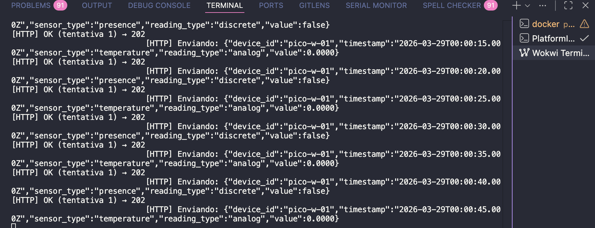
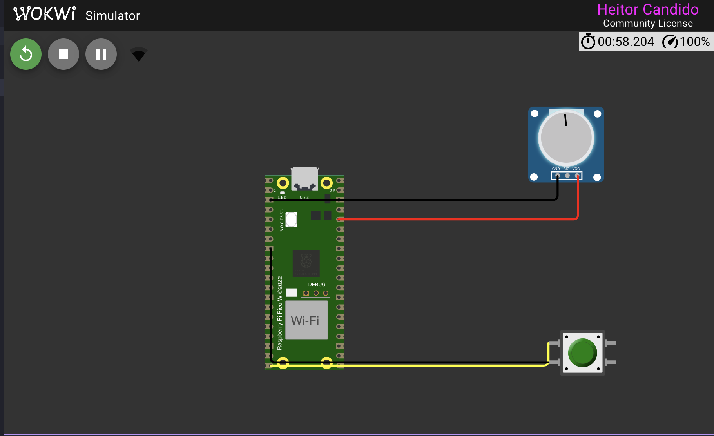
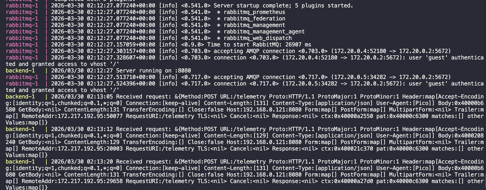

# Ponderada 2 — Firmware Embarcado para Raspberry Pi Pico W

> **Autor:** Heitor Candido  
> **Data:** 29/03/2026  
> **Framework:** Arduino (via PlatformIO)  
> **Simulador:** Wokwi  

---

## Visão Geral

Esta atividade expande a arquitetura de monitoramento industrial construída na Atividade 1 adicionando um firmware embarcado para o **Raspberry Pi Pico W**. O dispositivo lê sensores analógicos e digitais simulados no Wokwi, conecta-se a uma rede Wi-Fi e envia pacotes de telemetria para o backend HTTP desenvolvido anteriormente.

```
┌─────────────────────────────────────────────────────────────────┐
│  Wokwi (simulador)                                              │
│                                                                 │
│   [Potenciômetro] ──ADC0──►  Raspberry Pi Pico W               │
│   [Push-button]   ──GP15──►  (firmware Arduino)                │
│                                    │                            │
│                              Wi-Fi (Wokwi-GUEST)               │
└────────────────────────────────────┼────────────────────────────┘
                                     │ HTTP POST /telemetry
                        ┌────────────▼───────────┐
                        │  Backend Go (porta 8080)│
                        └────────────┬───────────┘
                                     │ AMQP
                        ┌────────────▼───────────┐
                        │       RabbitMQ          │
                        └────────────┬───────────┘
                                     │ consume
                        ┌────────────▼───────────┐
                        │  Consumer Go → Postgres │
                        └────────────────────────┘
```

---

## Estrutura do Repositório

```
mu-pond2/
├── docker-compose.yaml          # Orquestra backend, consumer, RabbitMQ e Postgres
├── backend/
│   ├── main.go                  # Servidor HTTP na porta 8080
│   ├── handler.go               # Handler POST /telemetry
│   ├── model.go                 # Struct Telemetry
│   ├── rabbitmq.go              # Publicação na fila AMQP
│   └── backend.Dockerfile
├── consumer/
│   ├── consumer.go              # Consome fila e persiste no Postgres
│   └── consumer.Dockerfile
├── db/
│   └── 01-create.sql            # Schema da tabela telemetry_readings
├── k6/
│   └── load_test.js             # Teste de carga (Atividade 1)
└── pico_firmware/
    ├── platformio.ini           # Configuração PlatformIO (rpipicow + Arduino)
    ├── diagram.json             # Circuito Wokwi
    ├── wokwi.toml               # Configuração da simulação
    └── src/
        └── main.ino             # Firmware principal ← foco desta atividade
```

---

## Firmware — `src/main.ino`

### Componentes simulados (Wokwi)

| Componente | Pino | Tipo |
|---|---|---|
| Potenciômetro | `GP26` (ADC0) | Analógico |
| Push-button (verde) | `GP15` | Digital (INPUT_PULLUP) |

O circuito é definido em `diagram.json`:

```json
"connections": [
  ["pico:ADC0", "pot1:SIG", "green",  []],
  ["pico:GP15", "btn1:1.l", "yellow", []],
  ["btn1:2.l",  "pico:GND.2","black", []]
]
```

**Circuito simulado no Wokwi:**



---

### 1 — Leitura de Sensores Digitais (2 pts)

O pino `GP15` é configurado como `INPUT_PULLUP`. A leitura `LOW` indica que o botão está pressionado (curto com GND). Um mecanismo de **debounce por tempo** (50 ms) filtra ruídos e transições espúrias:

```cpp
const int DEBOUNCE_MS = 50;
bool lastDigitalState = LOW;
unsigned long lastDebounce = 0;

// dentro do loop():
bool digitalReading = digitalRead(DIGITAL_PIN) == LOW; // LOW = pressionado
if (millis() - lastDebounce > DEBOUNCE_MS) {
    lastDigitalState = digitalReading;
    lastDebounce     = millis();
}
```

O estado estabilizado (`lastDigitalState`) é incluído no payload de telemetria com `sensor_type = "presence"` e `reading_type = "discrete"`.

---

### 2 — Leitura de Sensores Analógicos (2 pts)

O ADC0 (`GP26`) tem resolução de **12 bits (0–4095)** no Pico W. Uma **média móvel simples** sobre as últimas 10 amostras reduz ruído elétrico. O valor final é convertido para tensão (0–3,3 V):

```cpp
const int NUM_SAMPLES = 10;
int analogSamples[NUM_SAMPLES];
int sampleIndex = 0;
bool bufferFull = false;

// coleta amostras a cada iteração do loop():
int rawValue = analogRead(ANALOG_PIN);
analogSamples[sampleIndex] = rawValue;
sampleIndex = (sampleIndex + 1) % NUM_SAMPLES;
if (sampleIndex == 0) bufferFull = true;

// calcula média:
float calcMovingAverage() {
    int count = bufferFull ? NUM_SAMPLES : sampleIndex;
    long sum = 0;
    for (int i = 0; i < count; i++) sum += analogSamples[i];
    return (float)sum / count;
}

// converte para volts:
float voltage = smoothedValue * (3.3f / 4095.0f);
```

O valor em volts é enviado como `sensor_type = "temperature"` e `reading_type = "analog"`.

---

### 3 — Conectividade Wi-Fi (2 pts)

A conexão Wi-Fi é o elo crítico entre o firmware embarcado e o backend. Todo o pipeline de telemetria depende dela: sem link Wi-Fi não há entrega de dados. O firmware trata esse elo em **três camadas**:

#### 3.1 — Conexão inicial no `setup()`

Ao ligar, o Pico W tenta se conectar à rede com até **20 tentativas** espaçadas 500 ms, totalizando até 10 s de espera. Se não conseguir, registra a falha e continua o boot — a reconexão acontecerá automaticamente no `loop()`.

```cpp
void connectWiFi() {
    Serial1.print("[WiFi] Conectando a ");
    Serial1.println(SSID);

    WiFi.begin("Wokwi-GUEST", ""); // rede do simulador Wokwi (sem senha)

    int attempts = 0;
    while (WiFi.status() != WL_CONNECTED && attempts < 20) {
        delay(500);
        Serial1.print(".");
        attempts++;
    }

    if (WiFi.status() == WL_CONNECTED) {
        Serial1.println();
        Serial1.print("[WiFi] Conectado! IP: ");
        Serial1.println(WiFi.localIP()); // ex: 10.0.0.2 (atribuído pelo bridge Wokwi)
    } else {
        Serial1.println("[WiFi] Falha. Tentará novamente no próximo ciclo.");
    }
}
```

#### 3.2 — Watchdog de reconexão no `loop()`

A cada iteração do loop principal (~10 ms), o firmware verifica `WiFi.status()`. Ao detectar `WL_CONNECTED == false`, dispara imediatamente `connectWiFi()` antes de tentar qualquer envio. Isso garante resiliência sem reiniciar o dispositivo:

```cpp
void loop() {
    // ... leitura de sensores ...

    // Reconexão automática — executado ANTES do envio de telemetria
    if (WiFi.status() != WL_CONNECTED) {
        Serial1.println("[WiFi] Desconectado, reconectando...");
        connectWiFi();
    }

    // Só envia se o intervalo passou (e só chega aqui se Wi-Fi OK)
    if (millis() - lastSendTime >= SEND_INTERVAL_MS) {
        lastSendTime = millis();
        sendTelemetry(...);
    }
}
```

#### 3.3 — Bridge de rede Wokwi → host

No simulador Wokwi, a rede `Wokwi-GUEST` funciona como uma bridge entre o firmware simulado e a rede real do computador host. O IP atribuído ao Pico W (ex: `172.217.192.95`) é roteado diretamente para `192.168.0.121:8080` onde o backend Docker está escutando. Esse mecanismo é transparente para o firmware.

```
Pico W (Wokwi) ──Wi-Fi Wokwi-GUEST──► bridge Wokwi ──► rede host ──► Docker :8080
```

---

### 4 — Envio de Telemetria e Integração com o Backend (2 pts)

Este é o ponto de integração entre o firmware e toda a stack da Atividade 1. Cada detalhe do payload foi definido para casar com a `struct Telemetry` do backend Go.

#### 4.1 — Formato do payload

O JSON é montado manualmente com `snprintf` (sem biblioteca extra) para economizar RAM no microcontrolador:

```cpp
// Sensor analógico (potenciômetro)
snprintf(body, sizeof(body),
  "{\"device_id\":\"%s\","
  "\"timestamp\":\"%s\","
  "\"sensor_type\":\"%s\","
  "\"reading_type\":\"%s\","
  "\"value\":%.4f}",
  DEVICE_ID, timestamp, sensorType, readingType, floatValue);

// Sensor digital (botão)
snprintf(body, sizeof(body),
  "{\"device_id\":\"%s\","
  "\"timestamp\":\"%s\","
  "\"sensor_type\":\"%s\","
  "\"reading_type\":\"%s\","
  "\"value\":%s}",
  DEVICE_ID, timestamp, sensorType, readingType,
  boolValue ? "true" : "false");
```

Os payloads resultantes:

```json
// enviado a cada 5s — sensor analógico
{
  "device_id":    "pico-w-01",
  "timestamp":    "2026-03-29T00:00:15.000Z",
  "sensor_type":  "temperature",
  "reading_type": "analog",
  "value":        0.0000
}

// enviado a cada 5s — sensor digital
{
  "device_id":    "pico-w-01",
  "timestamp":    "2026-03-29T00:00:15.000Z",
  "sensor_type":  "presence",
  "reading_type": "discrete",
  "value":        false
}
```

#### 4.2 — Mapeamento Firmware ↔ Backend ↔ Banco

Cada campo do JSON do firmware mapeia diretamente para a `struct Telemetry` do Go e a coluna correspondente no Postgres:

| Campo JSON (firmware) | Campo Go (`model.go`) | Coluna Postgres |
|---|---|---|
| `device_id` | `DeviceID string` | `device_id VARCHAR(100)` |
| `timestamp` | `Timestamp string` | `timestamp TIMESTAMP` |
| `sensor_type` | `SensorType string` | `sensor_type VARCHAR(50)` |
| `reading_type` | `ReadingType string` | `reading_type VARCHAR(20)` |
| `value` (float) | `Value interface{}` → `float64` | `value_numeric DOUBLE PRECISION` |
| `value` (bool) | `Value interface{}` → `bool` | `value_boolean BOOLEAN` |

O consumer Go resolve o tipo de `Value` em runtime com type switch:

```go
switch v := t.Value.(type) {
case float64:
    valueNumeric = &v   // potenciômetro → value_numeric
case bool:
    valueBoolean = &v   // botão → value_boolean
}
```

#### 4.3 — Mecanismo de retry

O firmware tenta até **3 vezes** com 1 s de intervalo. O código de sucesso esperado é `202 Accepted`, retornado pelo handler Go após publicar na fila RabbitMQ:

```cpp
const int MAX_RETRIES = 3;
for (int attempt = 1; attempt <= MAX_RETRIES; attempt++) {
    HTTPClient http;
    http.begin(BACKEND_URL);                         // http://192.168.0.121:8080/telemetry
    http.addHeader("Content-Type", "application/json");

    int statusCode = http.POST(body);

    if (statusCode == 202) {                         // backend retornou 202 Accepted
        Serial1.printf("[HTTP] OK (tentativa %d) → %d\n", attempt, statusCode);
        http.end();
        return;                                      // sucesso — sai imediatamente
    }
    Serial1.printf("[HTTP] Falha (tentativa %d) → %d\n", attempt, statusCode);
    http.end();
    delay(1000);                                     // aguarda 1s antes de tentar de novo
}
Serial1.println("[HTTP] Todas as tentativas falharam.");
```

#### 4.4 — Evidência: serial do firmware enviando para o backend

O terminal serial do Wokwi mostra os pacotes sendo enviados e confirmados com `202` a cada 5 segundos:



#### 4.5 — Evidência: backend e RabbitMQ recebendo as requisições

Os logs do Docker mostram o backend Go recebendo os `POST /telemetry` vindos do Pico W simulado (`RemoteAddr: 172.217.192.95`) e o RabbitMQ aceitando as conexões AMQP do backend e do consumer:



Destaque dos logs do backend:

```
backend-1 | 2026/03/30 02:13:05 Received request:
  Method:POST URL:/telemetry
  Content-Type:[application/json]
  User-Agent:[Pico]
  RemoteAddr:172.217.192.95:50077   ← IP do Pico W no bridge Wokwi

backend-1 | 2026/03/30 02:13:12 Received request: ...
backend-1 | 2026/03/30 02:13:20 Received request: ...
```

O campo `User-Agent: [Pico]` confirma que a requisição veio do `HTTPClient` do firmware Arduino.

---

## Backend (referência — Atividade 1)

O backend Go expõe `POST /telemetry`, decodifica o JSON, publica na fila RabbitMQ `telemetry_queue` e retorna `202`:

```go
// handler.go
func TelemetryHandler(w http.ResponseWriter, r *http.Request) {
    var telemetry Telemetry
    json.NewDecoder(r.Body).Decode(&telemetry)
    PublishToQueue(telemetry)
    w.WriteHeader(http.StatusAccepted)
}
```

O consumer Go consome a fila e persiste no Postgres:

```sql
INSERT INTO telemetry_readings
  (device_id, timestamp, sensor_type, reading_type, value_numeric, value_boolean)
VALUES ($1,$2,$3,$4,$5,$6)
```

---

## Configuração PlatformIO (`platformio.ini`)

```ini
[env:rpipicow]
platform  = https://github.com/maxgerhardt/platform-raspberrypi.git
board     = rpipicow
framework = arduino
board_build.core = earlephilhower
lib_deps  =
    WiFi
    HTTPClient
build_flags =
    -DARDUINO_RASPBERRY_PI_PICO_W
    -DUSE_TINYUSB
monitor_speed = 115200
```

O core **earlephilhower** é necessário para suporte completo a Wi-Fi no Pico W dentro do ecossistema Arduino/PlatformIO.

---

## Como Executar

### 1. Subir o backend (Docker)

```bash
cd mu-pond2
docker compose up --build
```

Serviços iniciados:
| Serviço | Porta |
|---|---|
| Backend HTTP | `8080` |
| RabbitMQ Management | `15672` |
| Postgres | `5432` |

### 2. Compilar o firmware

```bash
cd pico_firmware
platformio run
```

### 3. Simular no Wokwi

Abra o projeto no VS Code com a extensão **Wokwi for VS Code** e inicie a simulação (`wokwi.toml` aponta para o firmware compilado). O Serial Monitor exibirá os logs de conexão Wi-Fi e envio HTTP.

**Saída real observada no serial (captura da simulação):**


```
[WiFi] Conectando a Wokwi-GUEST
..
[WiFi] Conectado! IP: 10.0.0.2
[HTTP] Enviando: {"device_id":"pico-w-01","timestamp":"2026-03-29T00:00:15.000Z","sensor_type":"presence","reading_type":"discrete","value":false}
[HTTP] OK (tentativa 1) → 202
[HTTP] Enviando: {"device_id":"pico-w-01","timestamp":"2026-03-29T00:00:20.000Z","sensor_type":"temperature","reading_type":"analog","value":0.0000}
[HTTP] OK (tentativa 1) → 202
```

**Backend e RabbitMQ em execução (Docker):**


---

## Fluxo de Dados Completo

```
Potenciômetro (ADC0)
    │ analogRead() × 10 amostras
    │ média móvel → volts
    └──► sendTelemetry("temperature","analog", voltage)
                              │
Push-button (GP15)            │
    │ digitalRead() + debounce│
    └──► sendTelemetry("presence","discrete", state)
                              │
                        HTTP POST (retry ×3)
                              │
                    ┌─────────▼─────────┐
                    │  Go Backend :8080  │
                    │  POST /telemetry   │
                    └─────────┬─────────┘
                              │ publish
                    ┌─────────▼─────────┐
                    │    RabbitMQ        │
                    │ telemetry_queue    │
                    └─────────┬─────────┘
                              │ consume
                    ┌─────────▼─────────┐
                    │  Go Consumer       │
                    │  INSERT Postgres   │
                    └───────────────────┘
```

---

## Decisões Técnicas

| Decisão | Justificativa |
|---|---|
| Média móvel (10 amostras) | Suaviza ruído do ADC sem biblioteca externa |
| Debounce por tempo (50 ms) | Elimina bouncing mecânico do botão |
| `INPUT_PULLUP` no GP15 | Evita pino flutuante sem resistor externo |
| JSON manual via `snprintf` | Evita dependência de biblioteca JSON em dispositivo com RAM limitada |
| Timestamp derivado de `millis()` | Pico W não tem RTC; em produção usar NTP |
| Retry ×3 com delay de 1 s | Garante entrega mesmo sob instabilidade de rede |
| `202 Accepted` como código de sucesso | Alinhado com o comportamento do backend (operação assíncrona via RabbitMQ) |
| Core earlephilhower | Único core com suporte completo a Wi-Fi para Pico W no PlatformIO |
